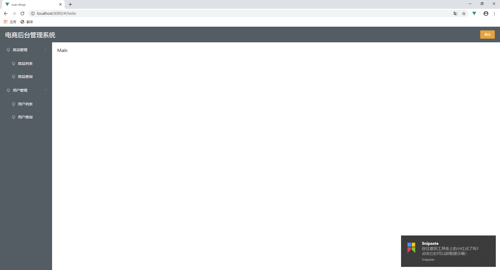

## 2020-01-04
- 根据后端数据动态显示菜单列表

## 2020-01-03
- 首页截图

- 主页截图

# vue-shop

## Project setup
```
npm install
```

### Compiles and hot-reloads for development
```
npm run serve
```

### Compiles and minifies for production
```
npm run build
```

### Customize configuration
See [Configuration Reference](https://cli.vuejs.org/config/).
